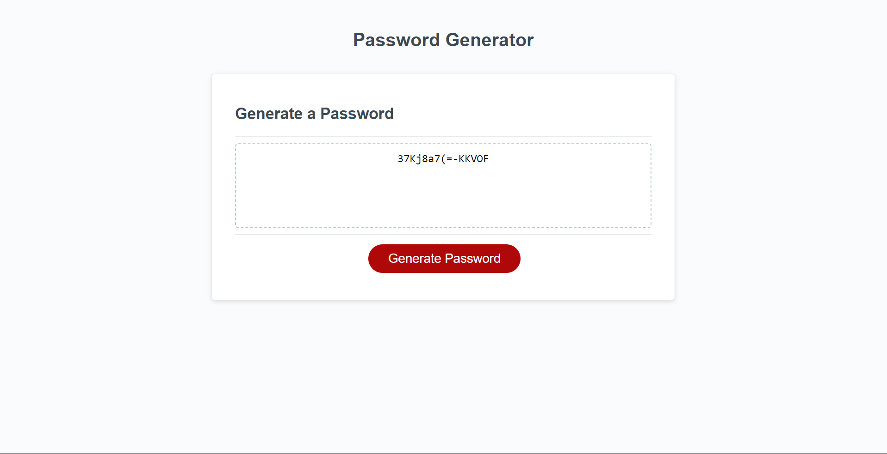

# Password-Generator

## Description

### User Story: 
AS AN employee with access to sensitive data
I WANT to randomly generate a password that meets certain criteria
SO THAT I can create a strong password that provides greater security

This password generator creates passwords based on the user's preferences with the given criteria of needing Uppercase letters, Lowercase letters, Numbers, and/or Special symbols.

## Installations
N/A

## Usage

### Acceptance Criteria:
GIVEN I need a new, secure password
WHEN I click the button to generate a password
THEN I am presented with a series of prompts for password criteria
WHEN prompted for password criteria
THEN I select which criteria to include in the password
WHEN prompted for the length of the password
THEN I choose a length of at least 8 characters and no more than 128 characters
WHEN asked for character types to include in the password
THEN I confirm whether or not to include lowercase, uppercase, numeric, and/or special characters
WHEN I answer each prompt
THEN my input should be validated and at least one character type should be selected
WHEN all prompts are answered
THEN a password is generated that matches the selected criteria
WHEN the password is generated
THEN the password is either displayed in an alert or written to the page

The password generator first asks for a length of password and a series of questions about it. It will then be able to create a password with the given values to make sure the password generator can possibly have characters in it then you want while making sure characters that you don't want are left out.
## Images
Screen shots of the website:
